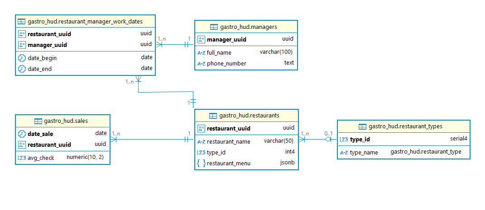

# 🍽 GastroHub SQL Project

SQL-проект по созданию расширенной базы данных для ресторанной сети GastroHub и выполнению аналитических задач. Реализован в рамках обучения, но все решения и архитектура проработаны вручную.

---

## 📘 ER-диаграмма базы данных

---

## 📦 Стек и технологии

- PostgreSQL 15+
- Типы данных: `UUID`, `ENUM`, `JSONB`, `ARRAY`
- Создание представлений и материализованных представлений
- Оконные функции: `ROW_NUMBER`, `LAG`
- `UPDATE ... FROM`, `CASE`, транзакции, блокировки
- Расчёт изменений в процентах и фильтрация

---

## 🧱 Структура проекта

- `DDL.sql` — создание схемы `gastro_hud`, таблиц и типов данных
- `INSERT.sql` — загрузка данных из схемы `raw_data`
- `task_1.sql` – `task_7.sql` — аналитические и обновляющие SQL-запросы
- `schema.PNG` — ER-диаграмма проекта
- `comments.txt` — пояснения к архитектуре и решениям

---

## 🔧 Особенности реализации

- Использован `ENUM` для типов заведений (bar, pizzeria, restaurant, coffee_shop)
- Меню заведений хранится в `JSONB` с динамическим разбором
- Использованы оконные функции для ранжирования и анализа по годам
- Реализованы безопасные транзакции и обновления с блокировками
- Обновление номеров менеджеров через `ARRAY` с сохранением истории

---

## 📊 Примеры задач

1. Топ-3 заведений по среднему чеку в каждом типе (`ROW_NUMBER()`)
2. Изменение среднего чека по годам с процентным сравнением (`LAG`, `AVG`)
3. Заведения с самой частой сменой менеджеров
4. Поиск пиццерии с наибольшим числом пицц в меню (`JSONB`)
5. Поиск самой дорогой пиццы в каждой пиццерии
6. Массовое обновление цен на капучино с блокировками (`BEGIN ... COMMIT`)
7. Обновление номеров менеджеров с использованием массивов

---

## 🚀 Как запустить проект

1. Разверните базу данных PostgreSQL (рекомендуется версия 15+)
2. Выполните дамп `dump-gastrohub.sql` (файл не входит в репозиторий)
3. Запустите последовательно:
   - `DDL.sql`
   - `INSERT.sql`
   - `task_1.sql` – `task_7.sql` по мере выполнения

---

